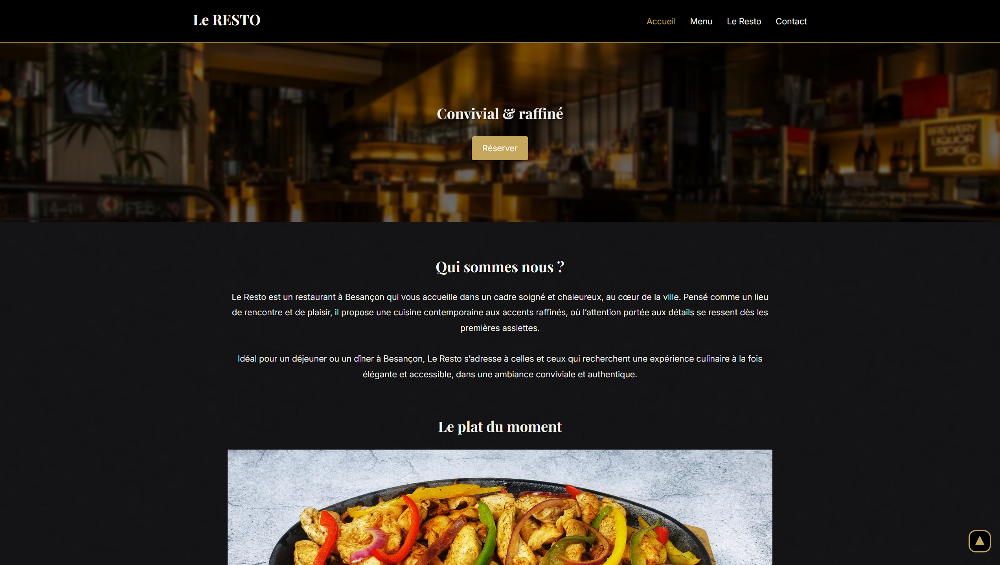

# 🍽️ Le Resto — Site vitrine fictif

Projet de site vitrine pour un restaurant fictif, réalisé dans le cadre de mon portfolio de développeur web freelance.
Ce modèle est pensé pour être décliné à d'autres types d'établissements (boulangerie, salon de coiffure, hôtel, etc.).

---

## 🎯 Objectif

Démontrer ma capacité à concevoir et développer un site vitrine complet, responsive et optimisé, intégrant :

- Une structure HTML sémantique multi-pages
- Un design personnalisé via SCSS
- Des interactions JavaScript natives
- L'intégration de composants Bootstrap

---

## 📄 Pages

| Page | Description |
|---|---|
| `index.html` | Accueil avec bannière, plat du moment et carrousel d'avis clients |
| `menu.html` | Carousel Bootstrap des suggestions + cartes de la carte avec bouton d'affichage |
| `le-resto.html` | Histoire du restaurant, équipe et valeurs |
| `contact.html` | Infos pratiques, carte Google Maps et formulaire de réservation |

---

## 🛠️ Technologies utilisées

- **HTML5** — structure sémantique
- **SCSS** — styles modulaires compilés en CSS, organisation par composants
- **JavaScript vanilla** — validation de formulaire, menu burger, carrousel d'avis clients
- **Bootstrap 5** — carousel des suggestions du menu
- **Google Fonts** — typographie
- **Google Maps Embed** — localisation sur la page contact

---

## ✨ Fonctionnalités

- Navigation responsive avec menu burger sur mobile
- Carousel d'avis clients en JavaScript natif
- Carousel Bootstrap pour les suggestions du menu
- Formulaire de réservation avec validation JS en temps réel (nom, téléphone, email, message)
- Message de succès géré entièrement en JavaScript
- Affichage des cartes du menu via lien natif `<a target="_blank">`
- Bouton de retour en haut de page
- Favicon personnalisé

---

## ⚡ Performance & bonnes pratiques

- Images converties en **WebP** et redimensionnées aux dimensions d'affichage réelles
- **Preconnect** Google Fonts pour réduire la latence
- Attribut `title` sur l'iframe Google Maps (accessibilité)
- Attributs `alt` sur toutes les images
- Balise `lang="fr"` sur le document HTML

---

## 📁 Structure du projet

```
le-resto/
├── index.html
├── menu.html
├── le-resto.html
├── contact.html
├── images/
│   ├── logo.png
│   ├── *.webp
│   └── ...
├── styles/
│   ├── style.css
│   ├── _contact.scss
│   ├── _colors.scss
│   └── ...
└── js/
    ├── burger.js
    ├── contact.js
    └── testimony.js
```

---

## 🔄 Déclinaisons possibles

Ce template est facilement adaptable à d'autres secteurs :

- Boulangerie / pâtisserie
- Salon de coiffure / esthétique
- Hôtel / gîte
- Bar / cave à vins
- Tout commerce local avec vitrine en ligne

---

## 👤 Auteur

**Christopher Devaux** — Développeur web freelance (auto-entrepreneur)
Région Bourgogne-Franche-Comté

[Portfolio](#https:/www.krisdevo.fr) · [LinkedIn](#https://www.linkedin.com/in/christopher-devaux/) · [GitHub](#https://github.com/Krisdevo)
